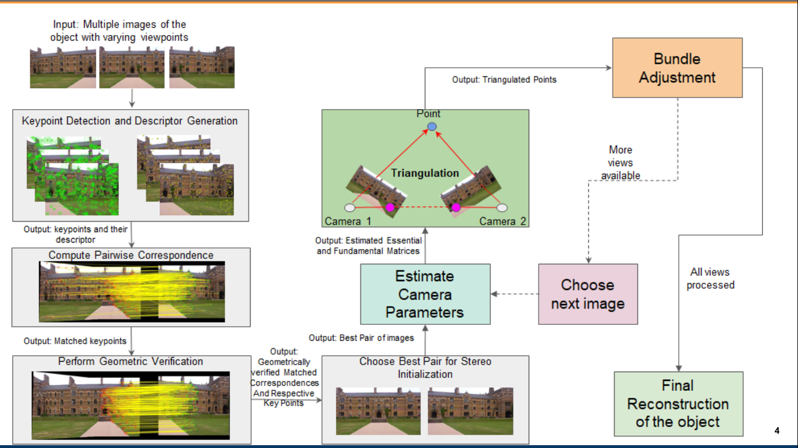
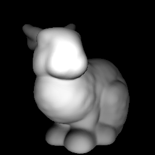
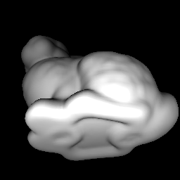
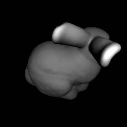
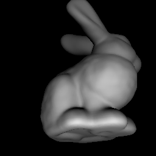
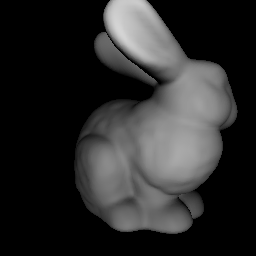

# 3D Object & Scene Reconstruction using Few 2D Images
I work on 3D scene reconstructions based on classical computer-vision and deep learning methods

## 1. Structure-from-Motion
**Repelicated Papers and run on our own data**
 Structure-from-Motion (SfM) is the process of reconstructing 3D structure from its projections into a series of images. The input is a set of overlapping images of the same object, taken from different viewpoints. The output is a 3D reconstruction of the object, and the reconstructed intrinsic and extrinsic camera parameters of all images. Typically, Structure-from-Motion systems divide this process into three stages:
   * Feature detection and extraction
   * Feature matching and geometric verification
   * Structure and motion reconstruction
**Block Diagram of SFM**

**Results**
|  |   | 
|:--:| :--: | 
|Reconstructed Frog-Bin | Reconstructed Cup |

## 2. Intrinsic3D-High-Quality 3D Reconstruction by Joint Appearance and Geometry Optimization with Spatially-Varying Lighting (ICCV 2017)
Replicated Results: Intrinsic3D is a method to obtain high-quality 3D reconstructions from low-cost RGB-D sensors. The algorithm recovers fine-scale geometric details and sharp surface textures by simultaneously optimizing for reconstructed geometry, surface albedos, camera poses and scene lighting.

**Results**
|  |   | 
|:--:| :--: | 
| Reconstructed Refined Lion | Reconstructed Refined Lion|

## 3. Scene Representation Network: Continuous 3D-Structure-Aware Neural Scene Representations (NeurIPS 2019)
Replicated Results: Scene Representation Networks (SRNs), a continuous, 3D-structure-aware scene representation that encodes both geometry and appearance. SRNs represent scenes as continuous functions that map world coordinates to a feature representation of local scene properties. By formulating the image formation as a neural, 3D-aware rendering algorithm, SRNs can be trained end-to-end from only 2D observations, without access to depth or geometry. SRNs do not discretize space, smoothly parameterizing scene surfaces, and their memory complexity does not scale directly with scene resolution.

## 4. SDFDiff: Differentiable Rendering of Signed Distance Fields for 3D ShapeOptimization (CVPR-2020)
Replicated Results:SDF-based dif-ferentiable renderer can be integrated with deep learningmodels, which opens up options for learning approaches on3D objects without 3D supervision.

**Results**

| Res 56 |  | |  | |  |  |
|:---:|:---:|:---:|:---:|:---:|:---:|:---:|
|-| Rendered 1  | Rendered 2 | Rendered 3 | Rendered 4 | Rendered 5 | Rendered 6 |

