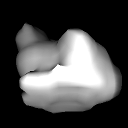
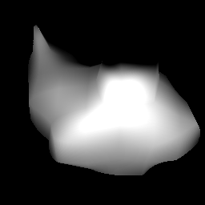

# Single-View & Multi-View 3D Reconstruction
### Based on Classical Computer-Vision and Deep Learning Methods

# Classical Methods
## 1. Structure-from-Motion
 Structure-from-Motion (SfM) is the process of reconstructing 3D structure from its projections into a series of images. The input is a set of overlapping images of the same object, taken from different viewpoints. The output is a 3D reconstruction of the object, and the reconstructed intrinsic and extrinsic camera parameters of all images. Typically, Structure-from-Motion systems divide this process into three stages:
   * Feature detection and extraction
   * Feature matching and geometric verification
   * Structure and motion reconstruction

**Block Diagram of SFM**
  After working on relevant research papers and provided tools, Overall method is depicted in our block diagram.

**Repelicated Codes and Experimentals on Our Data**
  3D shape and texture reconstruction of a Frog-Bin and Cup using 35 and 63 multi-view images respectively
|  |   | 
|:--:| :--: | 
|Reconstructed Frog-Bin | Reconstructed Cup |

## 2. Intrinsic3D
### High-Quality 3D Reconstruction by Joint Appearance and Geometry Optimization with Spatially-Varying Lighting (ICCV 2017)
  Intrinsic3D is a method to obtain high-quality 3D reconstructions from low-cost RGB-D sensors. The algorithm recovers fine-scale geometric details and sharp surface textures by simultaneously optimizing for reconstructed geometry, surface albedos, camera poses and scene lighting.

  **Repelicated Code and Experimental Work**
  Tested on the same RGB-D data used in this paper 
|  |
|:--:| 
| Reconstructed Refined Lion |

# Deep Learning Based Methods
## 1. Scene Representation Network: 
### Continuous 3D-Structure-Aware Neural Scene Representations (NeurIPS 2019)
  Scene Representation Networks (SRNs), a continuous, 3D-structure-aware scene representation that encodes both geometry and appearance. SRNs represent scenes as continuous functions that map world coordinates to a feature representation of local scene properties. By formulating the image formation as a neural, 3D-aware rendering algorithm, SRNs can be trained end-to-end from only 2D observations, without access to depth or geometry. SRNs do not discretize space, smoothly parameterizing scene surfaces, and their memory complexity does not scale directly with scene resolution.
 
  **Repelicated Code and Experiments on Synthetic and Real Dataset**
   Tweaked and evaluated SRNs on real objects for novel views generation and it failed in this task as **Agustus** and **Flower** are real objects and their 3D scene is rough.
| ShapeNet (Sythetic Data) | |
|:---:|:---:|
| Agustus (Real Data) |  |
| Flower (Real Data) | |
| |Normal &nbsp;&nbsp;&nbsp;&nbsp;&nbsp;&nbsp;Rendered &nbsp;&nbsp;&nbsp;&nbsp;&nbsp;&nbsp; Groundtruth|

## 2. SDFDiff 
### Differentiable Rendering of Signed Distance Fields for 3D Shape Optimization (CVPR-2020)
  SDF-based differentiable renderer can be integrated with deep learning models, which opens up options for learning approaches on 3D objects without 3D supervision.
  **Repelicated Code and Experimental Work**
  **Multi-View-3D Resconstruction Results**
  based on Signed Distance Field and Differentiable Rendering
| Res 56 |  | |  | |  |  |
|:---:|:---:|:---:|:---:|:---:|:---:|:---:|
| Res 32 |  | |  | |  | |
| Res 16 |  | |  | |  | |
| Res 8 |  | |  | |  | |
|-| Rendered View 1  | Rendered View 2 | Rendered View 3 | Rendered View 4 | Rendered View 5 | Rendered View 6 |

## 3. Differentiable Volumetric Rendering
### Learning Implicit 3D Representations without 3D Supervision
Proposes an analytic gradients for the predicted depth map with respect to the network parameters of the implicit shape and texture representation. It use ShapeNet data for single-view 3D reconstruction and real dataset to evaluate multi-view 3D reconstruction performance.
 
**Repelicated Code and Experimental Work**
  I am currently implementing this paper and finding one direction for my publication, any collaboration will be welcomed.

